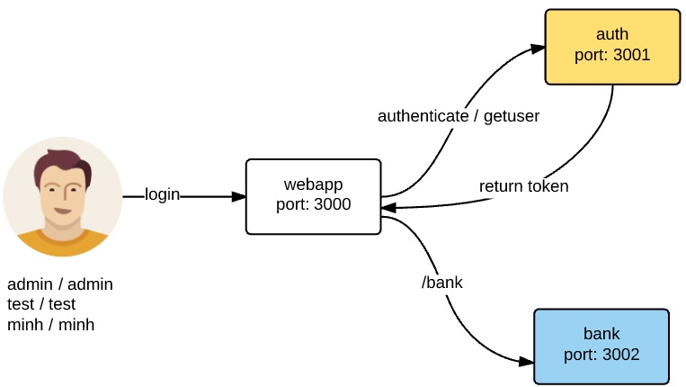

# Demo authentication service sử dụng JWT

Có 4 thư mục:
1. gulp để lưu file gulpfile.js để tự động hóa. Tham khảo thêm ví dụ tự động hóa [gulp_npm_start](https://github.com/TechMaster/gulp_npm_start)
2. auth, http://localhost:3001, micro-service làm nhiệm vụ authenticate user và trả lời web token
    - /login  đăng nhập login user, password
    
3. webapp, http://localhost:3000, web app có dữ liệu đặc biệt
    - /secret yêu cầu phải có bảo mật mới được xem
    - /share cho phép xem thoải mái
    - /callback để http://localhost:3001/login truyền web token khi người dùng đăng nhập thành công
4. bank, http://localhost: 3002, micro-service trả về dữ liệu ngân hàng

     
     

# Cách chạy thử nghiệm:

```
git clone https://github.com/TechMaster/jwtservice
cd jwtservice/gulp
gulp install
gulp
```

1. Dùng browser vào http://localhost:3000, đăng nhập với một trong các tài khoản:
    - admin/admin
    - test/test
    - minh/minh

2. Người dùng đăng nhập, ứng dụng này chỉ demo nên chỉ có 2 tài khoản [test, test] và [admin, admin]. Nếu login thành công, auth sẽ
post webtoken vào http://localhost:3000/callback, sau đó trả web token cho người dùng rồi chuyển hướng đến http://localhost:3000/secret

3. Với web token, người dùng sẽ truy cập được http://localhost:3000/secret hoặc http://localhost:3002 với điều kiện localhost:3002 cho phép CORS

# CORS là gì?

Ở microservice bank, có các request từ các server khác domain do đó phải bật CORS.
- [https://npmjs.org/package/cors](https://github.com/expressjs/cors)

